# Classification-et-segmentation-des-imageries-medicales

### 1. Introduction 

Le projet consiste à faire la classification des imageries médicales des poumons en deux classes : 
1. **Classe 0** : Poumon n'est pas atteint par le covid19.
2. **Classe 1** : Poumon atteint par le covid19. 

La deuxiéme étape du projet consiste à faire la segmentation en divisant les images en masques de segmentation correspondant à chaque classe (poumons non atteints par le COVID-19, poumons atteints par le COVID-19).
1. Exemple d'une image native normal et son masque correspondant :
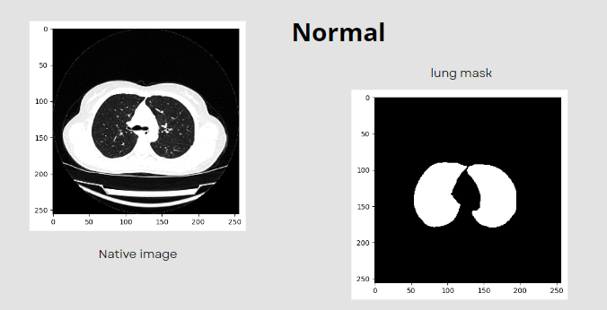 

2. Exemple d'une image native portant la pathologie et son masque correspondant :
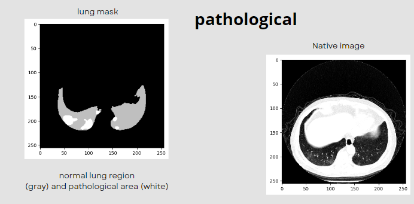 

### 2. Structure du Dataset 

La dataset est organisé comme suit : 
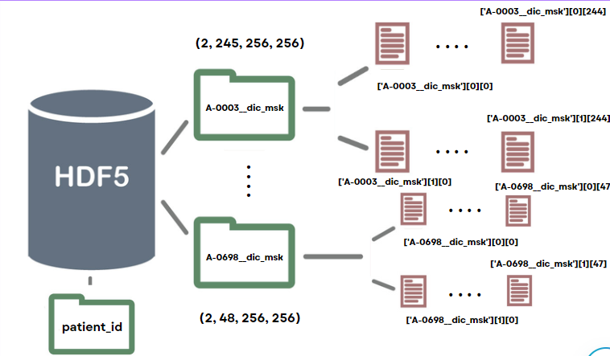

### 3. Classification : 

Pour la classification, le choix était un modéle VGG16 qui est un modèle de réseau de neurones convolutionnels (CNN) largement utilisé dans le domaine de la vision par ordinateur et de l'apprentissage automatique. VGG16 est composé de 16 couches de convolution, de regroupement (pooling) et de couches entièrement connectées. Les couches de convolution sont utilisées pour extraire les caractéristiques des images en analysant des portions de l'image à la fois. On a implémenté cette architecture comme premier essai car il est relativement simple par rapport à d'autres architectures plus récentes comme ResNet ou Inception. Puis, on a expérimenté avec ResNet18 composé de 18 couches de convolution, de regroupement (pooling) et de couches entièrement connectées.Enfin, on a testé les performances de chaque modéle.
1. **VGG16** : 
1.1. Implémentation : 
 

**Premier Essai** 
Initialement on a utilisé comme optimizer ADam avec un learning rate = 0.001, initialisation aléatoire des poids, on a entrainé initialement sur 30 epochs et on a utilisé le BCEwithLogits comme fonction loss.
→ Résultats préliminaires :

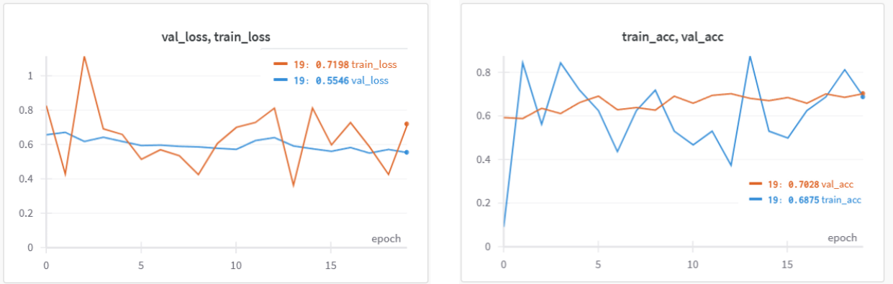 

Les résultats ne sont pas trés satisfaisants. La perte dépasse 0.4, les valeurs de train accuracy et validation accuracy ne sont pas performants. En plus, on remarque une instabilité numérique et une lente convergence.

**Deuxième Essai**
 Des améliorations ont été faites : 
 comme première réflexion, on a entamé une technique de preprocessing d’image utilisant le z-score afin de centraliser l’image autour de 0, permettant de réduire l’echelle des valeurs ce qui peut agir squr la rapidité de calcul et la rapidité de convergence. l’initialisation de poids avec xavier uniforme permettant d’eviter le probleme de disparition ou explosion de gradient qui peut être causé par l’initlalisation random et aussi l’exposition du modéle à une large variété de data avec la technique de data augmentation peuvent agir sur les performances du modéle et réduire le loss et éventuellement le gradient clip permet de contrôler le seuil de gradient agissant ainsi sur la stabilité numérique du loss. 

 → Résultats :

 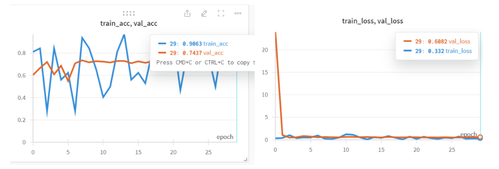 

 les attentes n’ont pas été toutes satisfaisantes mais prometteuses, la valeur de train loss en diminution flagrante malgré l’instabilité numérique, et à la fin de l'entraînement, les valeur de train accuracy ont ete améliorées

 - le systéme arrive à détecter correctement 1131 cas ou exemples vrai négatif c a dire  sains, non porteurs de la pathologie covid 19.  et 605  cas de vrai positifs c’est à dire des cas atteints par le covid 19 ces deux valeurs souligne un taux de prédiction correcte de : 73% ( c’est à dire l’accuracy) soulignant le nombre de cas qui ont été prédits correctement parmis tout les cas de l’ensemble 
  → L'analayse de la matrice de confusion :

  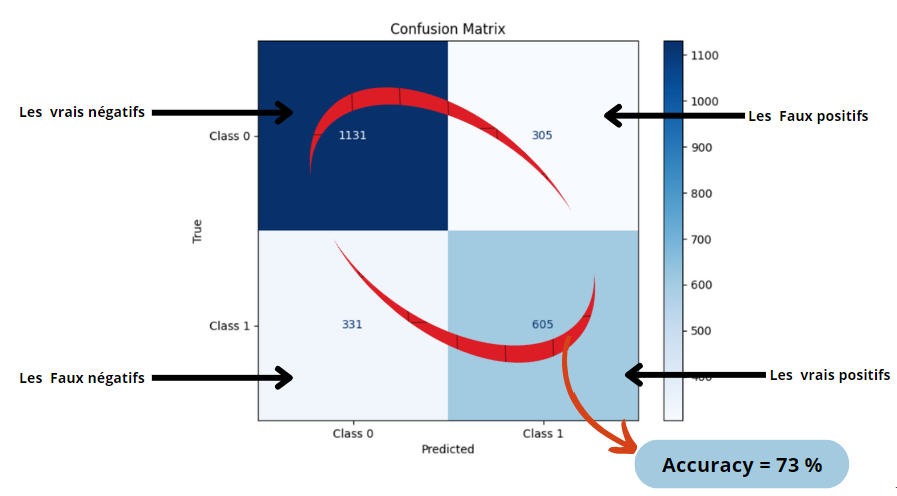 

  - Quant à la précision de modèle c’est à dire sa capacité à détecter correctement les cas qui sont porteurs de la maladie covid 19  parmi tous les cas prédits atteints par le covid.  elle atteint une valeur de 66%.
  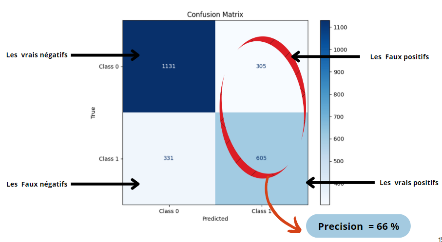 

  -  le modèle à une capacité de 65 % pour prédire correctement les cas atteints par le covid parmis les cas qui sont réellement atteints par cette maladie. 

 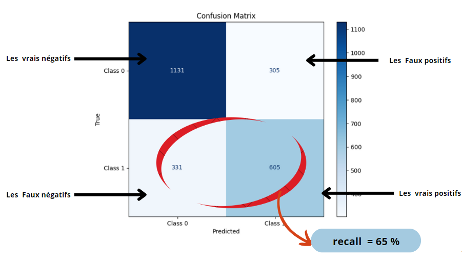  

 Conclusion : Résultats prometteux ==> expérimentation avec ResNet18 

2. **ResNet18** :  

On a convergé vers resnet18 grace à sa profondeur accrue qui lui permet d'apprendre des caractéristiques complexes et hiérarchiques à partir des données, ce qui est particulièrement important pour les tâches de vision par ordinateur où les relations entre les caractéristiques peuvent être très complexes. De plus, les blocs résiduels aident à atténuer le problème du "disparition du gradient" lors de l'entraînement de réseaux profonds en permettant à l'information de sauter plusieurs couches, facilitant ainsi le flux du gradient pendant la rétropropagation et accélérant la convergence.

Les connexions de saut entre les blocs résiduels permettent également de conserver l'information à travers les différentes couches du réseau, ce qui aide à prévenir la perte d'information et à accélérer la convergence. Cette architecture permet également une formation plus stable, ce qui peut réduire le temps nécessaire pour entraîner le modèle.

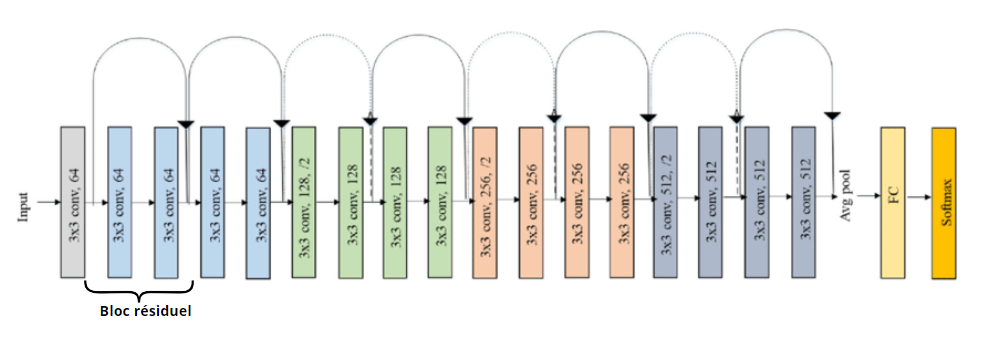  

→ Résultats :

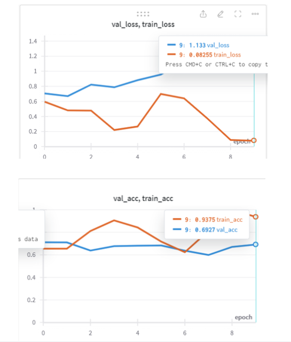 

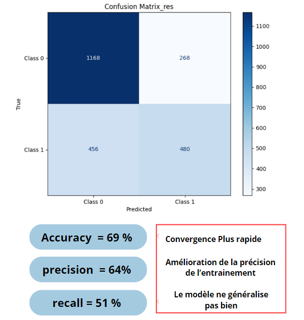 

Après la première tentative d'exécution, on remarque : 
- la précision d'entraînement (train accuracy) et la perte d'entraînement (train loss) n'ont pas montré d'amélioration significative, avec la perte d'entraînement minimale atteinte. Cependant, lors de la validation, il est apparu que le modèle n'a pas réussi à généraliser correctement. En revanche, une nette amélioration a été constatée en termes de rapidité de calcul et de convergence.

### 4. Segmentation : 

1. **UNet** : 
1.1. Implémentation : 

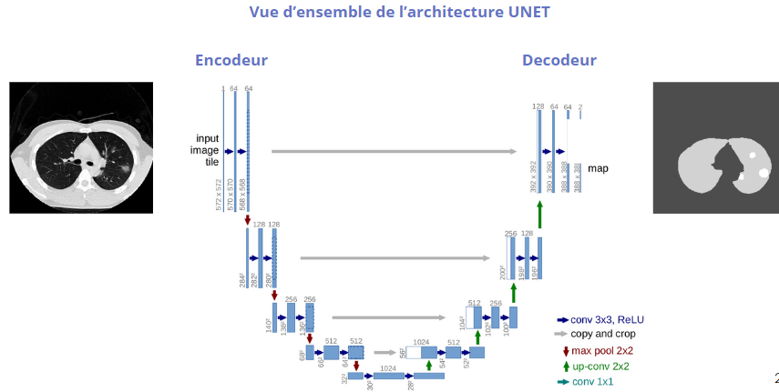 

2.2 Résultats préliminaires : 

Les résultats ne sont pas satisfaisants meme si le Dice est élevé et le loss est trés petit mais les résultats de prédiction de segmentation ne sont pas prometteux. 

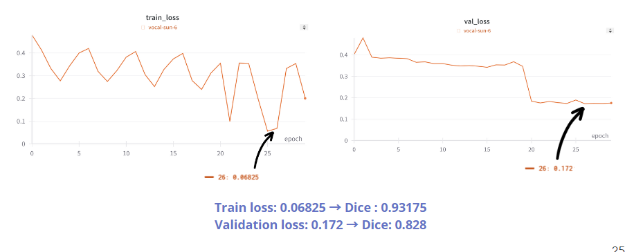

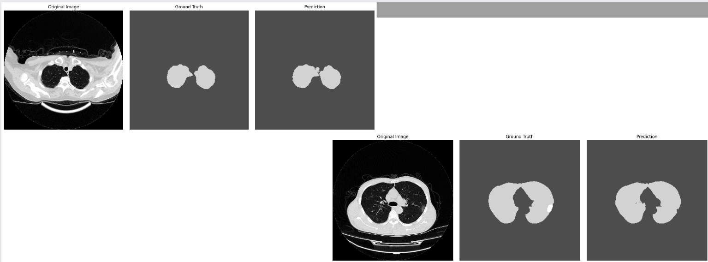

2.2 Résultats aprés premiére améliorations : 

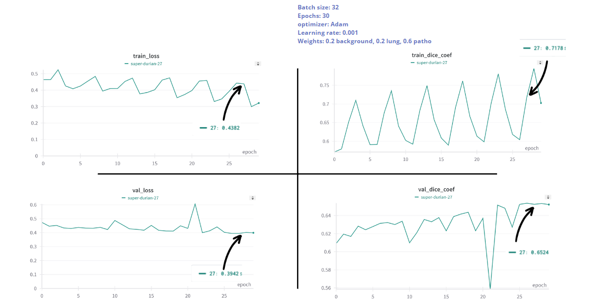

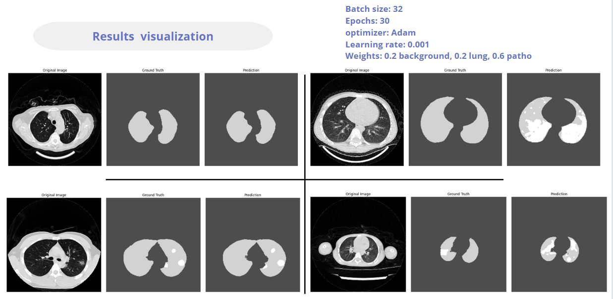

3.3 Résultats aprés deuxième améliorations : 

- Changement de l'optimiseur Adam à AdamW
- Implémentation de la normalisation Z-score 
- Initialisation Xavier pour les poids

[Exemple d'image](Images/resunet5.png)

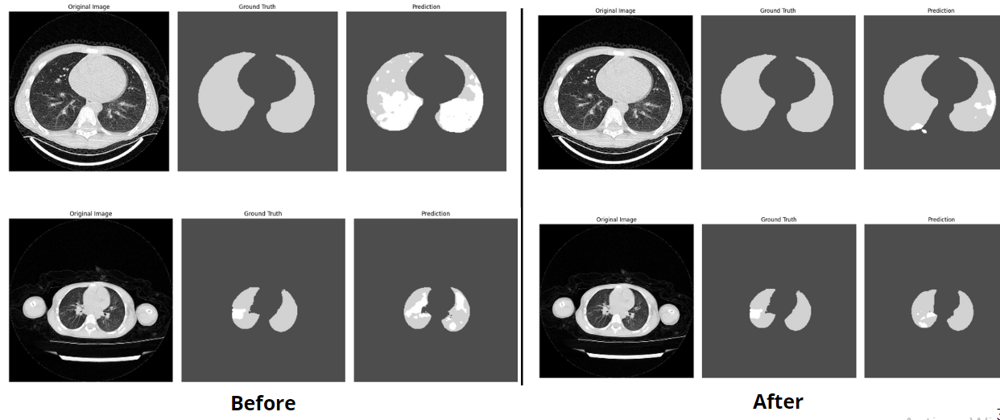